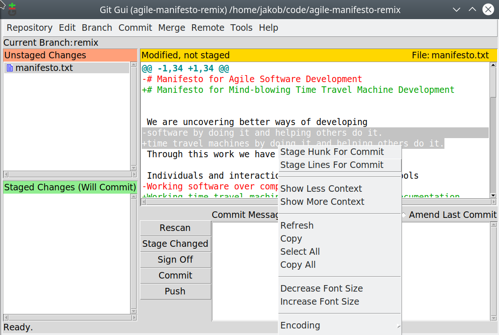

# Preparing a set of git commits for code review

This is a guide on preparing code changes for review. The goal is to present the reviewer with a set of git commits where:
- Each commit is relatively small.
- All changes in a commit are strongly related.
- All strongly related changes are in a single commit.

Usually, by the time new code is ready for review, it comes in a very different form. There is a large number of small commits, and a few huge commits. Related changes are sprinkled across multiple commits. Some commits fix work done in previous commits. But all of that is OK; it is impractical to try and create a perfectly neat set of commits during development. However, this should be improved for the purpose of code review.

There are multiple ways to go about refactoring git commits. This guide presents a way that allows most control over what goes into what commit and works even with the most messy initial set of commits. The idea is to completely break apart original commits, leaving us with a set of uncommitted changes, and then create new commits by picking out changes line by line. This may sound like a lot of work and error prone; this guide shows how to use various git tools and safety procedures to make the process safe, smooth and quick.

## Initial state

Suppose we have a repository that contains the [Agile Manifesto](http://agilemanifesto.org/) in a simple text file `manifesto.txt`.

We start with one commit on the `master` branch, which has been pushed into the remote repository named `origin`.
Here is an excerpt of what `git show` shows as the contents of the first commit:

    commit 6f8ae23dc7497cc491112bbdd8e09a69e07f6947 (HEAD -> master, origin/master)
    Author: Jakob Leben <jakob.leben@gmail.com>
    Date:   Wed Nov 7 11:47:28 2018 -0800

        Original manifesto

    diff --git a/manifesto.txt b/manifesto.txt
    new file mode 100644
    index 0000000..19a47fd
    --- /dev/null
    +++ b/manifesto.txt
    @@ -0,0 +1,61 @@
    +# Manifesto for Agile Software Development
    +
    +
    +We are uncovering better ways of developing
    +software by doing it and helping others do it.
    +Through this work we have come to value:
    +
    +Individuals and interactions over processes and tools
    +Working software over comprehensive documentation
    +Customer collaboration over contract negotiation
    +Responding to change over following a plan
    +
    +That is, while there is value in the items on
    +the right, we value the items on the left more.
    +
    +
    +# Principles behind the Agile Manifesto
    +
    +
    +We follow these principles:
    +Our highest priority is to satisfy the customer
    +through early and continuous delivery
    +of valuable software.

    etc.

Now we branch off this commit with a new branch named `remix`. We do a bunch of edits to `manifesto.txt`, committing them as we go. Finally, this is the list of commits on `remix` branch shown by `git log --oneline` (the topmost is the latest):

    ba103a9 (HEAD -> remix) Fix title (forgot to replace words there)
    0baf466 Replace 'Agile' with 'Mind-blowing'
    aab2f21 Replace 'software' with 'time travel machines'
    6f8ae23 (origin/master, master) Original manifesto

Here's an excerpt from the first new commit:

    commit aab2f218e7f1e35e80614a18f76eb57dd1372050
    Author: Jakob Leben <jakob.leben@gmail.com>
    Date:   Wed Nov 7 12:01:48 2018 -0800

        Replace 'software' with 'time travel machines'

    diff --git a/manifesto.txt b/manifesto.txt
    index 19a47fd..aefdbe1 100644
    --- a/manifesto.txt
    +++ b/manifesto.txt
    @@ -2,11 +2,11 @@

    We are uncovering better ways of developing
    -software by doing it and helping others do it.
    +time travel machines by doing it and helping others do it.
    Through this work we have come to value:

    Individuals and interactions over processes and tools
    -Working software over comprehensive documentation
    +Working time travel machines over comprehensive documentation
    Customer collaboration over contract negotiation
    Responding to change over following a plan

    etc.

... the second commit:

    6f8ae23 (origin/master, master) Original manifesto
    jakob@edgecase:~/code/agile-manifesto-remix$ git show 0baf466
    commit 0baf466a8407a15aa82621a1d8df5a5c20eb2cba
    Author: Jakob Leben <jakob.leben@gmail.com>
    Date:   Wed Nov 7 12:03:35 2018 -0800

        Replace 'Agile' with 'Mind-blowing'

    diff --git a/manifesto.txt b/manifesto.txt
    index aefdbe1..08c0688 100644
    --- a/manifesto.txt
    +++ b/manifesto.txt
    @@ -14,7 +14,7 @@ That is, while there is value in the items on
    the right, we value the items on the left more.

    -# Principles behind the Agile Manifesto
    +# Principles behind the Mind-blowing Manifesto

    We follow these principles:
    @@ -23,7 +23,7 @@ through early and continuous delivery
    of valuable time travel machines.

    Welcome changing requirements, even late in
    -development. Agile processes harness change for
    +development. Mind-blowing processes harness change for
    the customer's competitive advantage.

    etc.

.. and the third commit:

    commit ba103a9a0a52c407ba1c90c1395a41d7afec9a06 (HEAD -> remix)
    Author: Jakob Leben <jakob.leben@gmail.com>
    Date:   Wed Nov 7 12:05:23 2018 -0800

        Fix title (forgot to replace words there)

    diff --git a/manifesto.txt b/manifesto.txt
    index 08c0688..f455688 100644
    --- a/manifesto.txt
    +++ b/manifesto.txt
    @@ -1,4 +1,4 @@
    -# Manifesto for Agile Software Development
    +# Manifesto for Mind-blowing Time Travel Machine Development

Note that the last commit simply fixes the first two commits. We would like to prepare this set of changes for code review, so we would like to present a set of commits where each commit makes a set of strictly related changes, and all related changes are handled by a single commit. In our case, we would like only two commits: one that replaces 'software' with 'time travel machines' and one that replaces 'Agile' with 'Mind-blowing'.

## Backing it up

First thing we should do is protect our work in case something goes wrong. The best way to do that is to back it up. We can do that in two ways:

1. Before refactoring commits, make sure all the commits are pushed to the remote repository.
2. Before refactoring commits, create a local backup branch.

The first step ensures a copy of our work somewhere off our computer, so even in the worst case of our computer exploding or something, there is still a copy in the world.

The second step may be useful later when we replace the current commits in the remote repository with the refactored commits. If that step goes wrong, we still have a local copy of our original work to restart the whole process.

### Push all commits to remote repository

Since we never pushed the remix branch yet, we run `git push -u origin remix`, which at the same time creates a `remix` branch in the remote repository, associates it with our local `remix` branch, and pushes commits from the local to the remote branch.

Now, `git log --oneline` shows the following. Note that the latest commit has `origin/remix` added to the title, which means the remote `remix` branch coincides with this commit.

    ba103a9 (HEAD -> remix, origin/remix) Fix title (forgot to replace words there)
    0baf466 Replace 'Agile' with 'Mind-blowing'
    aab2f21 Replace 'software' with 'time travel machines'
    6f8ae23 (origin/master, master) Original manifesto

### Create local backup of commits

We will make a local backup of the `remix` branch and name it `remix-backup`. This is simply achieved using the command `git branch remix-backup`.

Now `git log --oneline` shows the following. Note that the latest commit also has `remix-backup` added to the title, which means we now have two copies of the `remix` branch: the remote `origin/remix` and the local `remix/backup`.

    ba103a9 (HEAD -> remix, origin/remix, remix-backup) Fix title (forgot to replace words there)
    0baf466 Replace 'Agile' with 'Mind-blowing'
    aab2f21 Replace 'software' with 'time travel machines'
    6f8ae23 (origin/master, master) Original manifesto

## Breaking commits apart

We are going to break apart all the initial commits, leaving us with a set of uncommitted changes, and then create new commits by picking out changes line by line.

First, make sure we are one the right branch. In our case, this is `remix`. The command `git branch` shows the following, which means we are OK (the star indicates the current branch):

      master
    * remix

We need to identify the earliest commit that we want to keep. Usually, that will be the commit where our branch branches off of master. In our case, that's the commit with ID `6f8ae23` which is also named `master`, since it is the tip of the `master` branch.

Now, we run the command:

    git reset 6f8ae23

which in our case is equivalent to

    git reset master

This will revert the current branch `remix` to `master`, but keep all the files unchanged, leaving us with a bunch of uncommitted changes.

`git status` tells us we have stripped away 3 commits, leaving `manifesto.txt` with uncommitted changes:

    On branch remix
    Your branch is behind 'origin/remix' by 3 commits, and can be fast-forwarded.
    (use "git pull" to update your local branch)

    Changes not staged for commit:
    (use "git add <file>..." to update what will be committed)
    (use "git checkout -- <file>..." to discard changes in working directory)

            modified:   manifesto.txt

`git diff` tells us what the uncommitted changes are. Note that these should include changes from all 3 commits:

    diff --git a/manifesto.txt b/manifesto.txt
    index 19a47fd..f455688 100644
    --- a/manifesto.txt
    +++ b/manifesto.txt
    @@ -1,12 +1,12 @@
    -# Manifesto for Agile Software Development
    +# Manifesto for Mind-blowing Time Travel Machine Development

    We are uncovering better ways of developing
    -software by doing it and helping others do it.
    +time travel machines by doing it and helping others do it.
    Through this work we have come to value:

    etc.

## Re-committing changes

Now, we want to commit some of the changes into one commit, and other changes into another commit. This is quite easy if all changes in a file go into a single commit - we can simply commit the entire file. We usually face the problem though that we want changes in one file to go into separate commits.

We need a tool that allows us to commit individual lines of a file rather than an entire file. Luckily, git comes with its own graphical tool to help us. It is started using the command `git gui`. This command brings up a window like this:

Selecting changed lines in the code view and right clicking on them brings up a menu with the option 'Stage Lines For Commit':

Clicking 'Stage Lines For Commit' will put only the selected lines into the git stage (similarily to how `git add` adds entire files to the stage). The file `manifesto.txt` then also appears in the list labeled 'Staged Changes' in the GUI. Clicking on the file there shows only the staged changes, which should include the lines we have just staged:

If we wish though, we can also stage entire files by selecting the files in the 'Unstaged Changes' list and using the main menu option Commmit / Stage To Commit.

The nice thing is that the git stage is stored in the filesystem so the staged changes remain if we quit the GUI and then open it again.

When all the changes we want in a commit are staged using the GUI, you can simply commit those changes in the GUI as well. By exploring the unstaged and staged changes, confirm that everything staged should be in the commit and everything that should be in the commit is staged. Enter the message into the 'Commit Message' field and click the 'Commit' button.

I do not recommend pushing changes using the GUI though. See below for the recommended process.

### Committing changes smaller than a line of code

Although `git gui` is pretty flexible in that it allows us to pick individual lines that we want to include in a commit, rarely we will have the problem that changes in a single line must be split between different commits. Here is an example in our manifesto - a single line changes `Agile` into `Mind-blowing` as well as `Software` into `Time Travel Machine`:

    @@ -1,34 +1,34 @@
    -# Manifesto for Agile Software Development
    +# Manifesto for Mind-blowing Time Travel Machine Development

Sometimes, this problem can be simplified by breaking the line of code into two lines and putting each line into a different commit. If that can not be done, we need to actually modify the line to contain only one change, commit that change, then modify the line again to introduce the other change and commit it again.

## Checking commits before pushing upstream

When we have re-committed all the changes into a clean set of commits for review, it's time to push the new commits into the remote repository.

First though, we want to confirm that the branch looks OK. In our case `git log --oneline` shows the following:

    acaefc8 (HEAD -> remix) Replace 'Agile' with 'Mind-blowing'
    9cf3881 Replace 'software' with 'time travel machines'
    6f8ae23 (origin/master, master) Original manifesto

Note several things:

- We have only two commits, as the changes that were previously in the third commit were split between the first and the second commit.
- The two commits have different IDs than before though, because their contents have changed.
- Also note that the latest commit does not correspond with `remix-backup` or `origin/remix` anymore.

The branches `remix-backup` and `origin/remix` remain intact and equal though, as shown by `git log remix-backup --online`:

    ba103a9 (origin/remix, remix-backup) Fix title (forgot to replace words there)
    0baf466 Replace 'Agile' with 'Mind-blowing'
    aab2f21 Replace 'software' with 'time travel machines'
    6f8ae23 (origin/master, master) Original manifesto

There is one **crucial** step to make sure that everything is OK before pushing. Remember that our goal was simply to refactor commits and not to introduce new or remove previous code changes. Therefore, the code in the refactored branch should be exactly the same as the code in the `remix-backup` and `origing/remix` branches. We can confirm this using the command:

    git diff origin/remix

If there are any differences between the current branch `remix` and the remote branch `origin/remix`, this command will display them. We expect there to be **no** differences!

However, if we conciously decided to make some new changes while refactoring the branch, then `git diff origin/remix` is also useful in order to review and confirm those changes.

## Pushing commits upstream

After confirming that the commit refactoring went OK, we are ready to push the refactored commits online.

If we simply do `git push origin remix`, git will complain:

    To github.com:jleben/agile-manifesto-remix.git
    ! [rejected]        remix -> remix (non-fast-forward)
    error: failed to push some refs to 'git@github.com:jleben/agile-manifesto-remix.git'
    hint: Updates were rejected because the tip of your current branch is behind
    hint: its remote counterpart. Integrate the remote changes (e.g.
    hint: 'git pull ...') before pushing again.
    hint: See the 'Note about fast-forwards' in 'git push --help' for details.

This is expected: we have refactored the branch, so pushing the branch means that commits in the remote branch must be removed and replaced instead of just adding new commits - and that's what git is warning us about.

However, the suggestions by git to integrate the remote changes do **not** apply in our case. Git assumes that the difference between the local and remote branch is due to some other collaborator having pushed commits into the remote branch. This is not the case here. We are about to intentionally discard the commits in the remote branch and replace them with ours.

So, let's ignore git's warning and use the `-f` flag to force pushing the branch while discarding those commits on the remote branch that are not also on the local branch:

    git push -f origin remix

When this is completed, `git log --oneline` should once again show that the local `remix` branch is equal to the remote `origin/remix`:

    acaefc8 (HEAD -> remix, origin/remix) Replace 'Agile' with 'Mind-blowing'
    9cf3881 Replace 'software' with 'time travel machines'
    6f8ae23 (origin/master, master) Original manifesto

There is one more check we can do to make sure that the remote branch still contains the exact same code as before the commit refactoring. Again, we are going to use `git diff` to compare code differences, but this time between the `remix-backup` branch and the remote `origin/remix` branch:

    git diff remix-backup origin/remix

Again, we are expecting this command to show **no** difference at all (unless we intentionally added some changes).

## Restoring backup in case of problems

If you have created a backup branch, you can easily restore it with a single command. The command `git reset --hard remix-backup` will make the current branch equal to the branch `remix-backup`. The `--hard` option means that the actual files will also be updated (as opposed to just the commit history), which means any difference from `remix-backup` will be lost. Before doing this, make sure you are on the right branch, for example using `git branch`!

If you don't have a local backup branch, but the original code is still on the remote branch, you can also reset to that branch. In our case: `git reset --hard origin/remix`.
